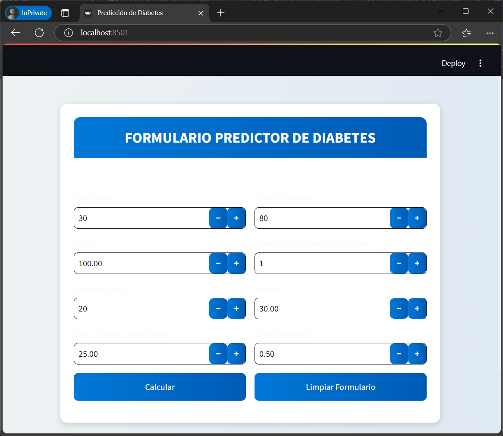

# Proyecto Predicción de Diabetes

Este proyecto utiliza modelos de machine learning para estimar la probabilidad de que un paciente desarrolle diabetes. Se basa en datos clínicos y biométricos, como niveles de glucosa, presión arterial, IMC, entre otros.

Integrantes: 

1. Jose Andres Carvajal
2. Ricardo Espinosa Peralta
3. Edwin López Castañeda
4. Alejandra Ossa Yepes  
  
# 📌 Guía para Ejecutar una Aplicación Streamlit Localmente

Este documento proporciona instrucciones detalladas para ejecutar una aplicación **Streamlit** en tu entorno local después de descargar o clonar el repositorio.

---

## 📌 Requisitos Previos
Antes de comenzar, asegúrate de tener instalado en tu sistema:
- **Python** (versión 3.7 o superior)
- **pip** (administrador de paquetes de Python)
- **Git** (opcional, si vas a clonar el repositorio)

Verifica las versiones con los siguientes comandos:
```sh
python --version
pip --version
git --version
```

---

## 📥 Descargar o Clonar el Proyecto
Si descargaste el proyecto en formato **ZIP**, extráelo en una carpeta.

Si prefieres clonar el repositorio, usa este comando:
```sh
git clone https://github.com/joseandrescarvajal1/proyecto-prediccion-diabtes.git
cd proyecto-prediccion-diabetes_front
```

---

## ⚙️ Crear un Entorno Virtual (Opcional, pero Recomendado)
Para evitar conflictos de dependencias, se recomienda crear un entorno virtual:
```sh
python -m venv venv
```
Luego, actívalo:
- **Windows:**
  ```sh
  venv\Scripts\activate
  ```
- **Mac/Linux:**
  ```sh
  source venv/bin/activate
  ```

---

## 📦 Instalar Dependencias
Dentro de la carpeta del proyecto, instala las dependencias con:
```sh
pip install -r requirements.txt
```
---

## 🚀 Ejecutar la Aplicación Streamlit
Para iniciar la aplicación, ejecuta:
```sh
streamlit run app.py
```
---

## 🌐 Acceder a la Aplicación
Una vez ejecutado, la aplicación se abrirá en tu navegador predeterminado. También verás en la terminal algo como:
```
Local URL: http://localhost:8501
Network URL: http://192.168.X.X:8501
```
Puedes hacer clic en el link para acceder al proyecto mediante el navegador.

  
Al acceder, deberás ver esta interfaz de usuario:  
  



## 🛑 Detener la Aplicación
Para detener la aplicación, presiona `CTRL + C` en la terminal.
Si activaste un entorno virtual y deseas salir, usa:
```sh
deactivate
```

---

